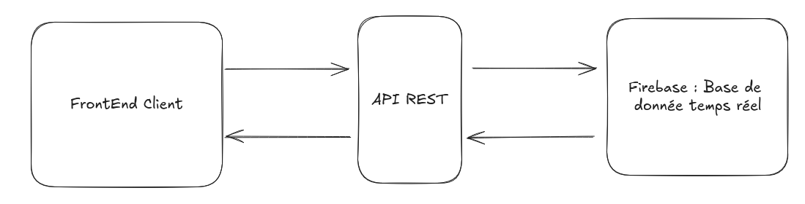
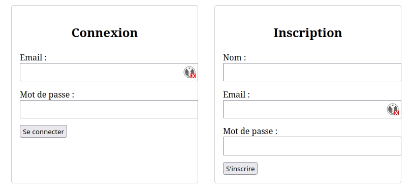
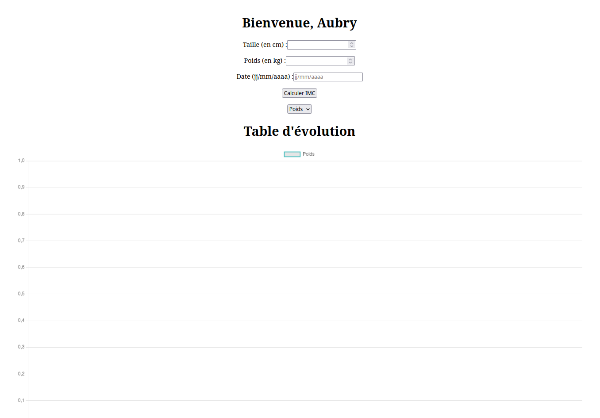
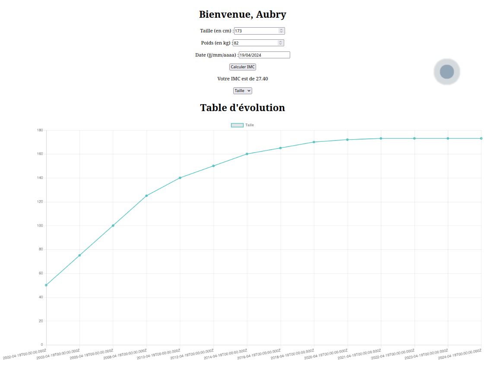

# Exercice 1 Tp1

## Objectif

L'objectif de cette exercice est de développer une application cloud, en JavaScript, capable de calculer l'Indice de Masse Corporelle (IMC) d'une personne à partir de son nom, son poids et sa taille. L'application peut être exécutée localement ou sur des plateformes comme Google Colab ou Jupyter. Les données collectées (nom, poids, taille et IMC) seront ensuite stockées dans une base de données en temps réel, telle que Firebase, pour permettre le suivi des informations. L'application permettra également de récupérer ces données depuis Firebase.


## Prérequis


- Node.js et npm version recente
- Un compte Firebase avec les clés d'accès (non incluses dans le dépôt pour des raisons de sécurité)

## Installation

Le projet se compose de deux sous parties : le front et le back. 


### Back

Pour installer le back, il faut se déplacer dans le dossier back et installer les dépendances avec la commande suivante :

```bash
$ cd ./Exercice 1/back
$ npm install
```

Ensuite, il faut accéder à l'interface de Firebase et que vous demandiez les accès pour avoir l'autorisation de lire et écrire dans la base de données. Une fois que vous avez les accès, vous pouvez placer le fichier .json que Firebase vous a donné dans le dossier back. Ensuite, vous devez indiquer le fichier dans le fichier BDDConfig.js. 

```javascript
//...
import serviceAccount from './imc-infonuagique-firebase-adminsdk-j3xx0-f05bc01d2d.json' assert {type: 'json'};
//...
```

Enfin, vous pouvez lancer le back avec la commande suivante :

```bash
$ npm start  # pour lancer le serveur en mode normal
$ npm run dev # pour lancer le serveur en mode développement avec les logs
```

### Front
Ce déplacer das le dossier client et installer les dépendances avec la commande suivante :

```bash
$ cd ./Exercice 1/front
$ npm install
```

Comme nous utilisons un framework Vue.js, il faut lancer le front avec la commande suivante :

```bash
$ npm run serve
```

Vous accéderez à l'application sur l'adresse suivante : http://localhost:8080/


## Choix dans la conception et contrainte

Vu que nous étions un trinome, nous avons décidé de rajouter des fonctionnalités à l'exercice afin de le rendre plus complet. Nous avons donc décidé de rajouter un front et faire une architecture web en mode client serveur. 


<figure>
    
    <figcaption>Architecture Client Server</figcaption>
</figure>

### FrontEnd Client

Le client dispose de deux pages : une page d'accueil et une page de connexion. La page d'accueil permet à l'utilisateur de s'inscrire ou de se connecter. 

<figure>
    
    <figcaption>Page de connexion</figcaption>
</figure>

Une fois connecté, l'utilisateur peut accéder à la page principale de l'application, où il peut saisir son poids et sa taille et une date pour calculer son IMC. 

<figure>
    
    <figcaption>Page avec le formulaire apres inscription</figcaption>
</figure>


L'utilisateur peut également consulter son IMC précédent et les données de santé stockées dans la base de données. L'utilisateur peut également se déconnecter de l'application.

<figure>
    
    <figcaption>Page avec le formulaire apres quelque valeurs de renseignées</figcaption>
</figure>


### API Rest

Choix de conception d'une API rest avec le front qui communique avec la base de données en temps réel de Firebase.

#### Détais de l'API

| Requête                  | Type de requête | Paramètres d'entrée                                                                 | Retour                                                                                   |
|--------------------------|-----------------|-------------------------------------------------------------------------------------|------------------------------------------------------------------------------------------|
| `/users/signup`          | POST            | `user` (string), `password` (string), `name` (string)                                | `200 OK` avec `message` et `user ID` ou `409 Conflict` si l'email est déjà utilisé        |
| `/users/login`           | POST            | `user` (string), `password` (string)                                                 | `200 OK` avec `message` et `user ID` ou `401 Unauthorized` en cas d'erreur de connexion   |
| `/users/getName/:user`   | GET             | `user` (string) dans l'URL                                                           | `200 OK` avec `nom` de l'utilisateur ou `400 Bad Request` si l'utilisateur n'est pas trouvé|
| `/users/getData/:user`   | GET             | `user` (string) dans l'URL                                                           | `200 OK` avec `data` de l'utilisateur ou `404 Not Found` si l'utilisateur n'est pas trouvé|
| `/users/sendHealthData`  | PUT             | `userID` (string), `poids` (number), `taille` (number), `date` (string)              | `201 Created` avec `message` et `IMC` ou `404 Not Found` si l'utilisateur n'est pas trouvé|


## Améliorations possibles

- Déployer l'application sur une plateforme comme Firebase Hosting pour la rendre accessible à tous et l'exécuter en ligne.


## Issues rencontrées

- Si vous utilisez Firefox, il est possible que vous rencontriez des problèmes de CORS. Pour les résoudre, vous pouvez installer l'extension CORS Everywhere et l'activer. Vous pouvez également utiliser un autre navigateur comme Chrome ou Edge.
- Nous recommandonc aussi l'utilisation d'un outil pour autoriser les requêtes CORS, comme l'extension Allow CORS pour Chrome.
