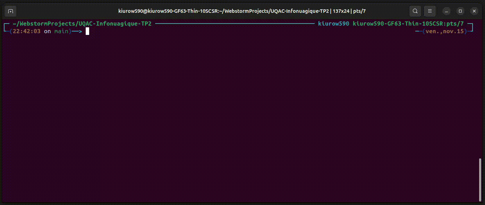
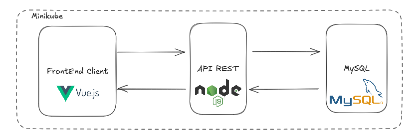

# Exercice 1 Tp2

## Objectif de l'Exercice

L'objectif de cet exercice est de développer une application cloud en **JavaScript** qui calcule l'**Indice de Masse Corporelle (IMC)** d'une personne. Le calcul de l'IMC sera effectué à partir des informations suivantes :
- Nom de la personne
- Poids (en kilogrammes)
- Taille (en mètres)

### Architecture de l'Application

L'application est structurée en trois niveaux :
1. **Backend** : Traitement des requêtes et calcul de l'IMC.
2. **Frontend** : Interface utilisateur pour saisir les informations et afficher le résultat.
3. **Base de Données** : Stockage des informations utilisateur (nom, poids, taille, IMC calculé).

### Déploiement

Chacun de ces composants est déployé dans un environnement **Minikube** en utilisant **Kubernetes** pour la gestion des conteneurs et l'orchestration des services.


## Prérequis

Avant de commencer, assurez-vous que les outils suivants sont installés sur votre environnement de développement :

- **Node.js** : Utilisez une version récente pour assurer la compatibilité avec les dernières fonctionnalités de JavaScript.
- **npm** : Gestionnaire de paquets pour Node.js, nécessaire pour installer les dépendances de l'application.
- **Kubernetes** : Plateforme de gestion de conteneurs pour orchestrer et déployer les services de l'application.
- **Minikube** : Environnement Kubernetes local, permettant de simuler un cluster Kubernetes sur une machine de développement.

Assurez-vous que toutes les installations sont configurées et que Minikube est en cours d'exécution avant de déployer les composants de l'application.


## Installation

L'installation de l'ensemble des composant se fait de la façon suivante : 

```bash
kubectl apply -f k8s/
```




<figure>
    
    <figcaption>Dashboard de l'ensemble des composants déployé</figcaption>
</figure>

## Commande pour accéder au front 

```bash
minikube service frontend-vue-app --url
```

## Choix dans la conception et contrainte

Vu que nous étions un trinome, nous avons décidé de rajouter des fonctionnalités à l'exercice afin de le rendre plus complet. Nous avons donc décidé de rajouter un front et faire une architecture web en mode client serveur. 


<figure>
    
    <figcaption>Architecture Minikube</figcaption>
</figure>

### FrontEnd Client

Le client dispose de deux pages : une page d'accueil et une page de connexion. La page d'accueil permet à l'utilisateur de s'inscrire ou de se connecter. 

<figure>
    
    <figcaption>Page de connexion</figcaption>
</figure>

Une fois connecté, l'utilisateur peut accéder à la page principale de l'application, où il peut saisir son poids et sa taille et une date pour calculer son IMC. 

<figure>
    
    <figcaption>Page avec le formulaire apres inscription</figcaption>
</figure>


L'utilisateur peut également consulter son IMC précédent et les données de santé stockées dans la base de données. L'utilisateur peut également se déconnecter de l'application.

<figure>
    
    <figcaption>Page avec le formulaire apres quelque valeurs de renseignées</figcaption>
</figure>


### API Rest

Choix de conception d'une API rest avec le back qui communique avec la base de données MySQL.

#### Détais de l'API


| Requête                  | Type de requête | Paramètres d'entrée                                                                 | Description                                                                                   |
|--------------------------|-----------------|-------------------------------------------------------------------------------------|-----------------------------------------------------------------------------------------------|
| `/users/signup`          | POST            | `email` (string), `password` (string), `name` (string)                               | Enregistre un nouvel utilisateur. Retourne `200 OK` avec `message` et `user ID` ou `409 Conflict` si l'email est déjà utilisé. |
| `/users/login`           | POST            | `email` (string), `password` (string)                                                | Authentifie un utilisateur. Retourne `200 OK` avec `message` et `user ID` ou `401 Unauthorized` si l'authentification échoue. |
| `/users/getName/:userId` | GET             | `userId` (string) dans l'URL                                                         | Récupère le nom de l'utilisateur. Retourne `200 OK` avec `name` ou `400 Bad Request` si l'utilisateur n'est pas trouvé. |
| `/users/getData/:userId` | GET             | `userId` (string) dans l'URL                                                         | Récupère les données de santé de l'utilisateur. Retourne `200 OK` avec `data` ou `404 Not Found` si aucune donnée n'est trouvée. |
| `/users/sendHealthData`  | PUT             | `userId` (string), `poids` (number), `taille` (number), `date` (string)              | Ajoute des données de santé pour l'utilisateur. Retourne `201 Created` avec `message` et `IMC` ou `404 Not Found` si l'utilisateur n'est pas trouvé. |

## Améliorations possibles

- La prise en charge de la modification et la suppression de certaines entrée.
